# DFBC-UIR
# Towards Degradation-Faithful and Background-Consistent Pseudo-Degradation Synthesis for Unsupervised Image Restoration

**DFBC-UIR** is a general unsupervised image restoration framework based on **Degradation-Faithful** and **Background-Consistent** pseudo-degraded image synthesis.  
Without requiring paired degraded-clean training data, DFBC-UIR constructs reliable pseudo pairs by faithfully transferring real degradation characteristics while preserving dense background correspondence with clean images.

<p align="center">
  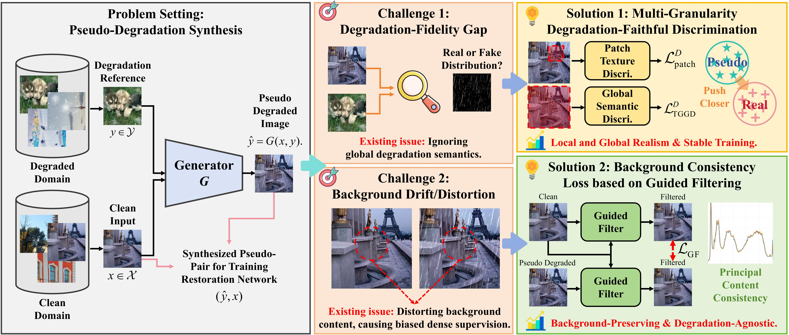
</p>
<p style="text-align: justify; text-justify: inter-word;">
  <em>
  Pseudo-degraded images synthesized by DFBC-UIR across multiple restoration tasks, including deraining, desnowing, specular highlight removal, demoireing, and shadow removal. The synthesized images preserve the underlying background content of clean inputs while faithfully transferring degradation characteristics from unpaired degraded references.
  </em>
</p>

## 🏗️ Method Overview

DFBC-UIR revisits unsupervised image restoration from the perspective of reliable pseudo-pair construction.  
Given unpaired clean images and degraded images, our goal is to synthesize pseudo-degraded images that satisfy two coupled requirements:

1. **Degradation Fidelity**: the synthesized image should faithfully match real degradation distributions.
2. **Background Consistency**: the synthesized image should remain content-aligned with its clean counterpart.

To this end, DFBC-UIR introduces a concise and general framework composed of three key components:

- **Guided-Filter-Based Background Consistency Loss (GFLoss)** for suppressing content drift during degradation transfer.
- **CLIP-Based Text-Guided Global Degradation Discriminator (TGGD)** for image-level degradation-semantic alignment.
- **Self-Reconstruction Strategy** for reducing degradation-irrelevant information transfer and improving synthesis reliability.

<p align="center">
  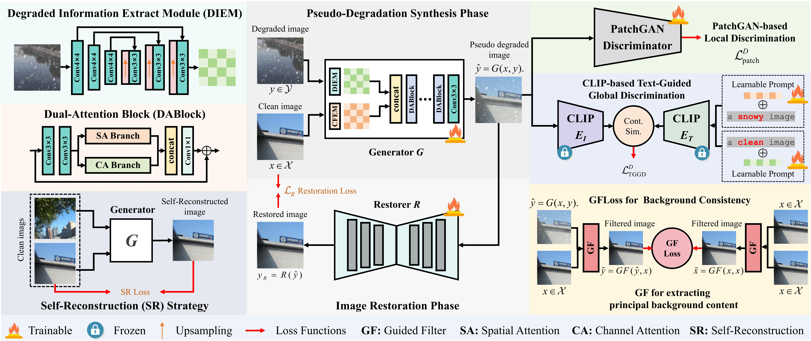
  <br>
  <em>Overview of DFBC-UIR: degradation-faithful and background-consistent pseudo-degradation synthesis for unsupervised image restoration.</em>
</p>

## 🚀 Key Innovations

### 1. A General Framework for Unsupervised Image Restoration

We propose **DFBC-UIR**, a general unsupervised image restoration framework that explicitly formulates reliable pseudo-pair construction as a joint problem of **degradation fidelity** and **background consistency**.  
The framework can be applied to diverse restoration tasks without paired training data, including rain, snow, specular highlights, moire patterns, and shadows.

### 2. Guided Filtering as a Training-Time Background Prior

We introduce a novel **guided-filter-based background consistency loss** for pseudo-degradation synthesis.  
Different from previous uses of guided filtering as a post-processing refiner or fixed filtering module, DFBC-UIR elevates guided image filtering to a **general training-time prior** for preserving principal background content during degradation transfer.

<p align="center">
  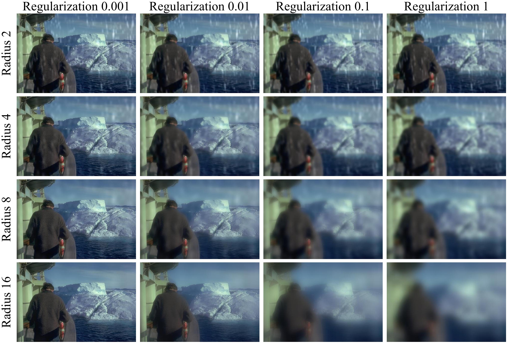
</p>

<p align="center">
  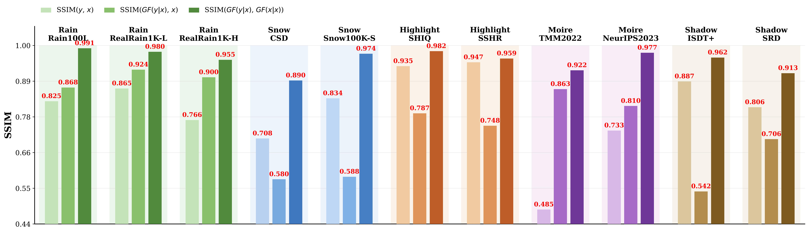
  <br>
  <em>Illustration of the guided-filter-based background consistency loss. GFLoss performs degradation-robust image-domain background alignment, preserving dense content correspondence while allowing realistic degradation injection.</em>
</p>

### 3. CLIP-Based Text-Guided Global Degradation Discrimination

We introduce a **CLIP-based text-guided global degradation discriminator** to enforce image-level degradation-semantic alignment.  
Instead of simply applying CLIP image-text similarity, the proposed TGGD uses task-aware positive and negative degradation prompts to adapt the vision-language semantic space for degradation discrimination. Combined with a standard local PatchGAN discriminator, it forms a complementary dual-discriminator design that improves degradation fidelity from both global semantic and local texture perspectives.

### 4. Self-Reconstruction for Reliable Degradation Transfer

To suppress degradation-irrelevant information transfer, DFBC-UIR incorporates a self-reconstruction strategy.  
This strategy encourages the generator to focus on degradation-related cues while avoiding the transfer of redundant background structures or edge textures from degraded reference images.

<p align="center">
  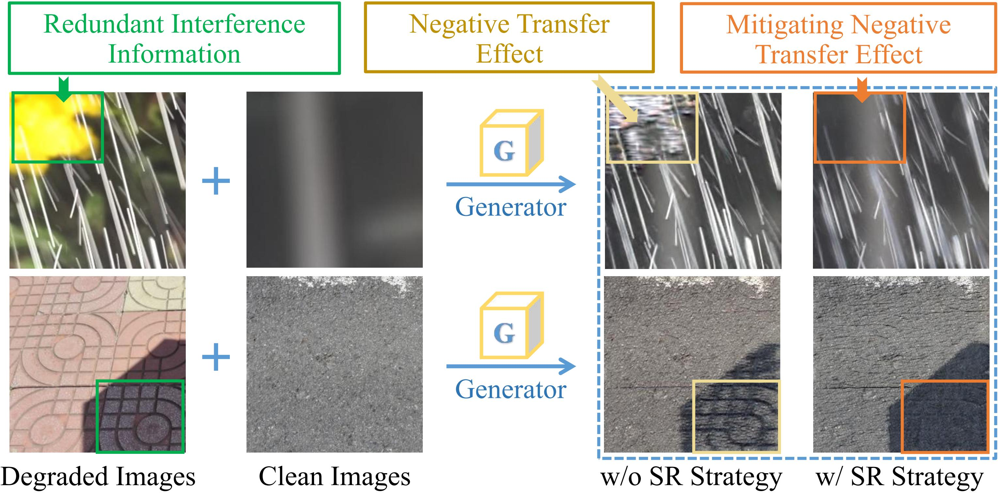
  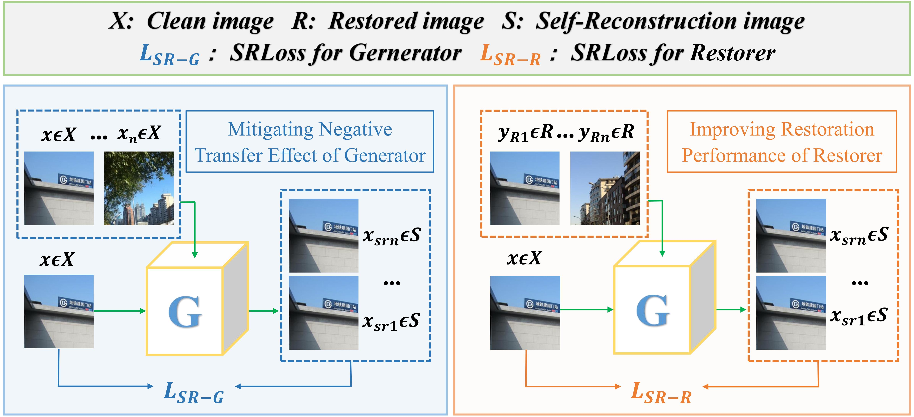
</p>

<p align="center">
  <em>Left: Visualization of the redundant information transfer problem and the effect of the self-reconstruction strategy. Right: Visualization of the self-reconstruction strategy.</em>
</p>

## 📊 Performance Highlights

### Extensive Evaluation Across Five Restoration Tasks

DFBC-UIR is evaluated on five representative unsupervised image restoration tasks:

- **Image Deraining**
- **Image Desnowing**
- **Specular Highlight Removal**
- **Image Demoireing**
- **Image Shadow Removal**

Across **15 benchmarks** and **19 evaluation settings**, DFBC-UIR achieves state-of-the-art performance among unsupervised methods, with PSNR improvements of up to **2.31 dB** over the strongest unsupervised competitors.

<p align="center">
  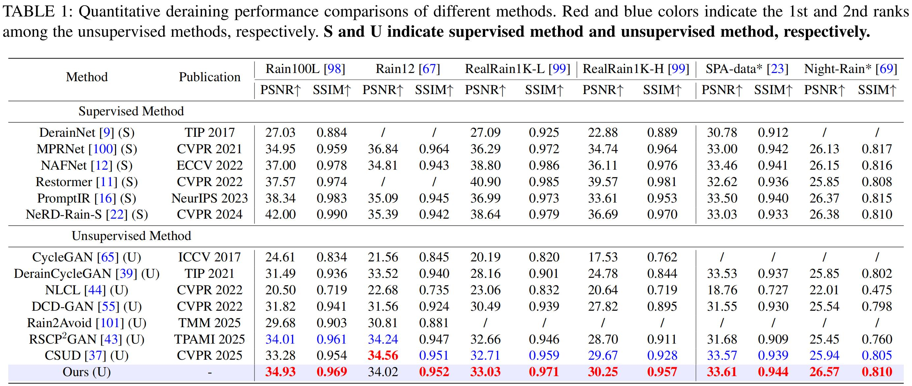
</p>

<p align="center">
  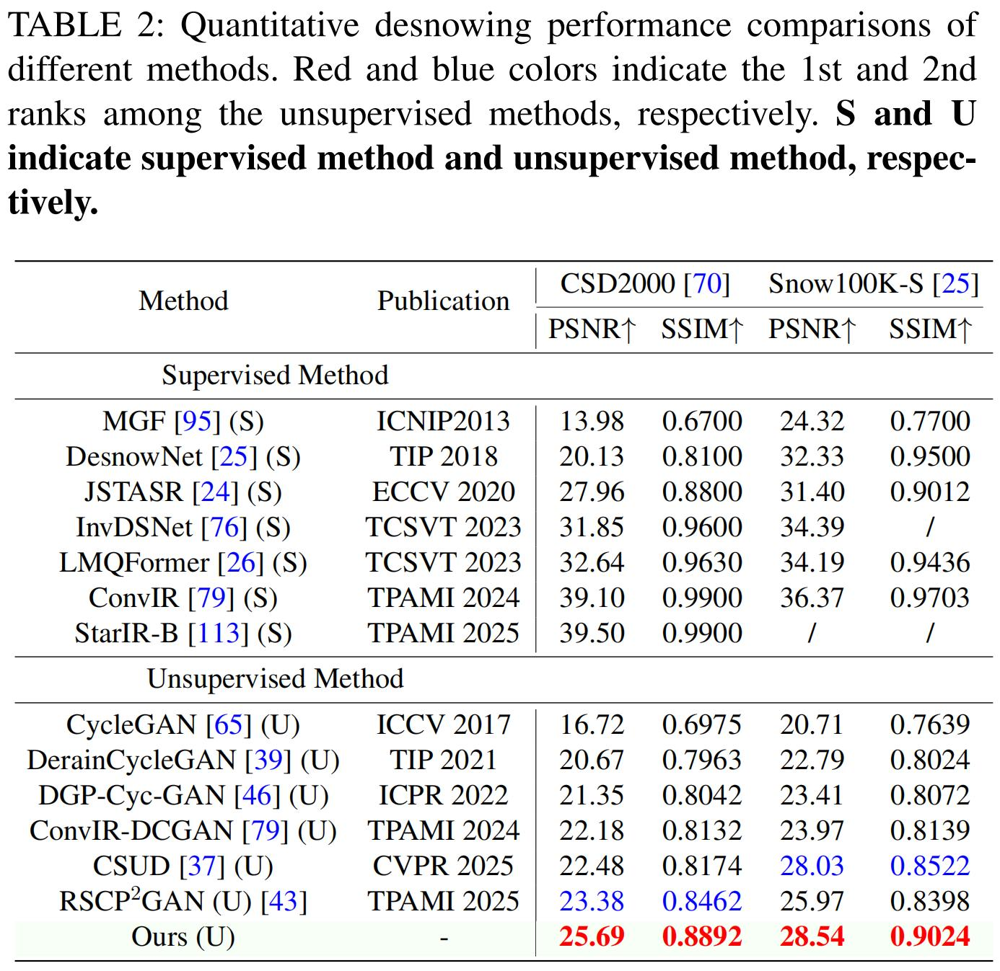
  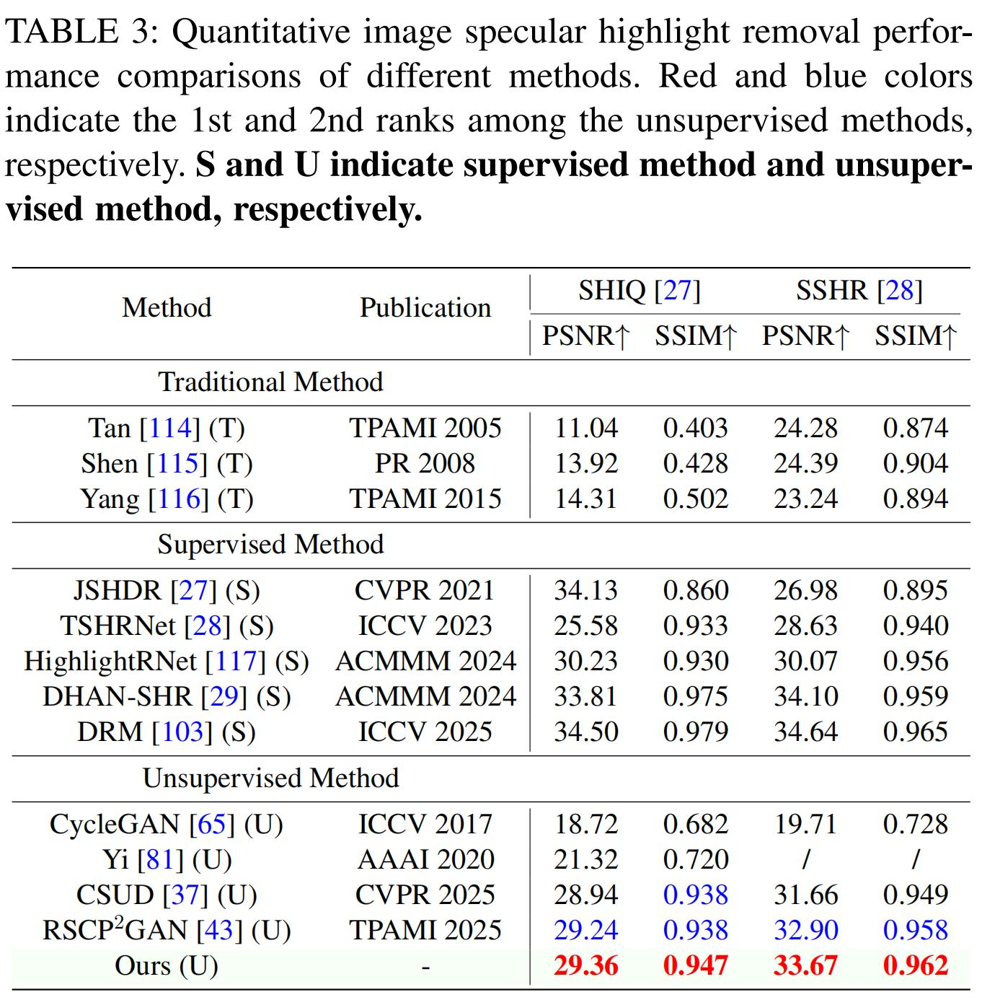
</p>

<p align="center">
  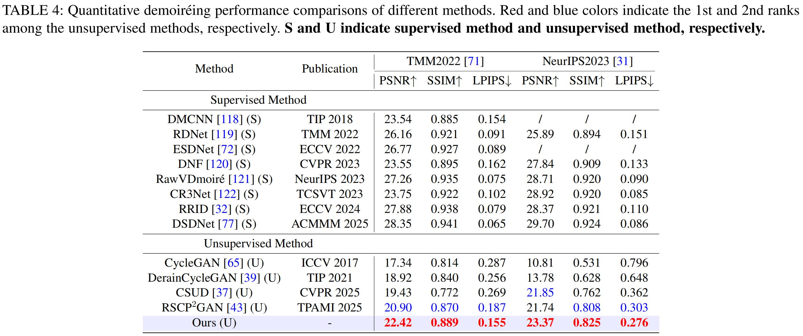
</p>

<p align="center">
  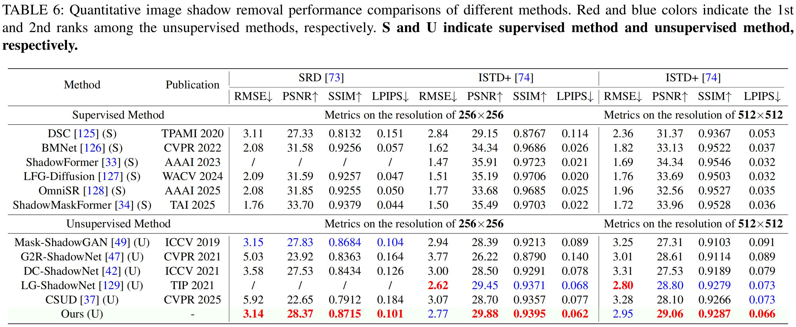
</p>

<p align="center">
  <em>Quantitative comparison with existing unsupervised and supervised restoration methods across multiple tasks and datasets.</em>
</p>

### Visual Comparisons

<p align="center">
  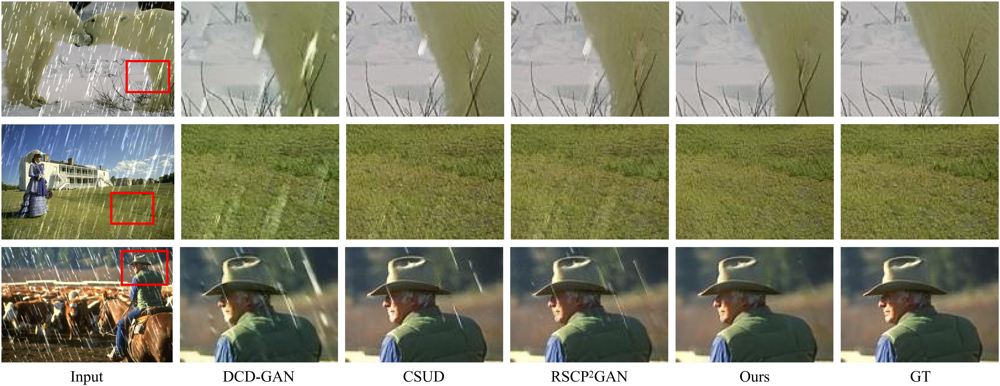
  <br>
  <em>Visual comparison on image deraining benchmarks.</em>
</p>

<p align="center">
  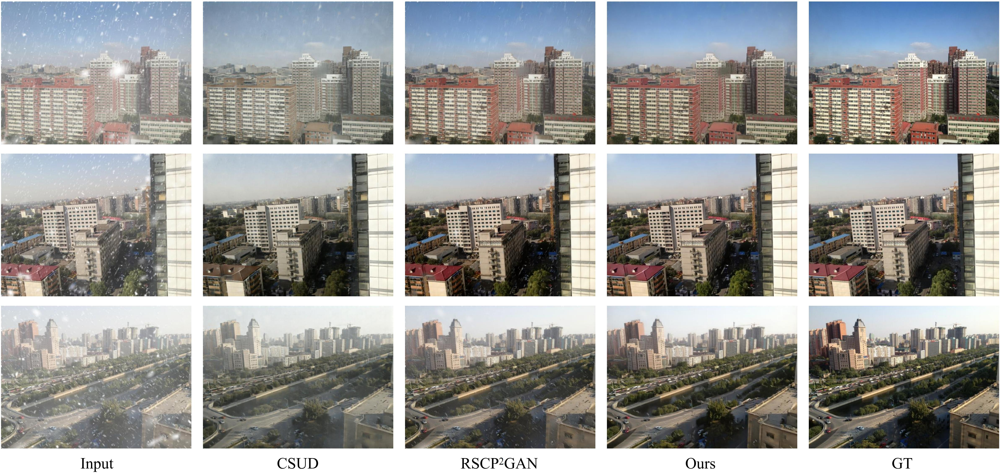
  <br>
  <em>Visual comparison on image desnowing benchmarks.</em>
</p>

<p align="center">
  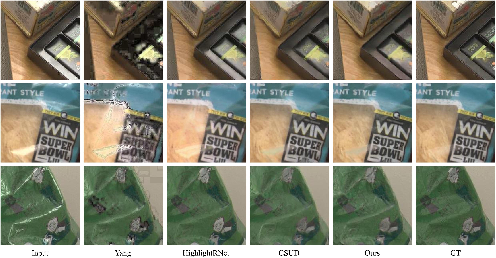
  <br>
  <em>Visual comparison on image specular highlight removal benchmarks.</em>
</p>

<p align="center">
  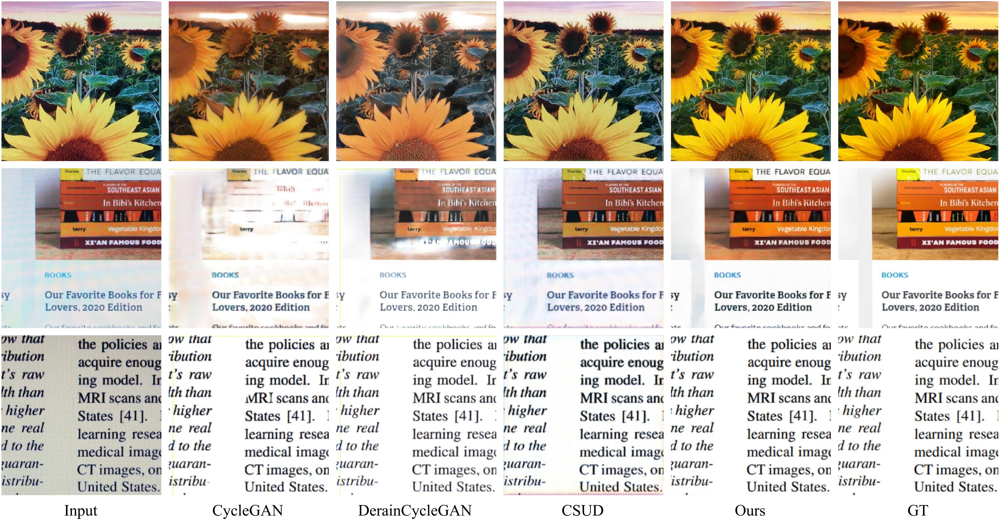
  <br>
  <em>Visual comparison on image demoireing benchmarks.</em>
</p>

<p align="center">
  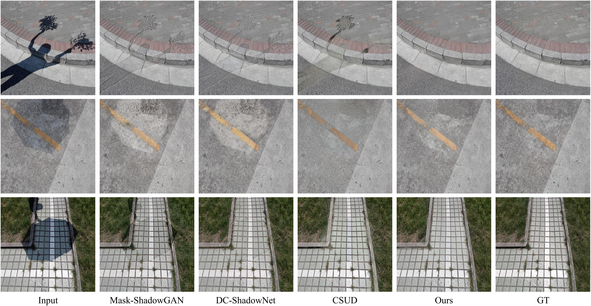
  <br>
  <em>Visual comparison on image shadow removal benchmarks.</em>
</p>
## 🛠️ Features

- **🌦️ General Restoration Framework**: supports multiple degradation types without paired supervision.
- **🧭 Background-Consistent Pseudo Pairs**: preserves dense content correspondence between pseudo-degraded inputs and clean targets.
- **🔍 Degradation-Faithful Synthesis**: combines global degradation-semantic discrimination with local texture realism.
- **🧠 CLIP-Guided Global Supervision**: introduces task-aware textual prompts for degradation-level semantic alignment.
- **🧩 Training-Time Priors Only**: GFLoss and TGGD improve training but do not increase the inference complexity of the restoration backbone.
- **📈 Extensive Evaluation**: validated across deraining, desnowing, highlight removal, demoireing, and shadow removal.

## 📁 Repository Structure

```text
DFBC-UIR/
├── figure/                  # Figures used in README
├── configs/                 # Training and testing configuration files
├── datasets/                # Dataset preparation scripts
├── models/                  # Generator, restoration network, and discriminators
├── losses/                  # GFLoss and other training losses
├── scripts/                 # Training and evaluation scripts
├── pretrained/              # Pretrained models
├── train.py
├── test.py
└── README.md
```

## 🚦 Quick Start

Code, pretrained models, and detailed instructions will be released upon publication.

### Installation

```bash
git clone https://github.com/chaoren88/DFBC-UIR.git
cd DFBC-UIR

conda create -n dfbc-uir python=3.9
conda activate dfbc-uir

pip install -r requirements.txt
```

### Data Preparation

Coming soon.

### Training

Coming soon.

### Testing

Coming soon.

## 📦 Pretrained Models

Pretrained models will be released upon publication.

| Task | Dataset | Model |
|---|---|---|
| Deraining | Rain100L / Rain12 / RealRain1K / SPA-DATA / Night-Rain | Coming soon |
| Desnowing | CSD / Snow100K | Coming soon |
| Specular Highlight Removal | SHIQ / SSHR | Coming soon |
| Demoireing | TMM2022 / NeurIPS2023 / UHDM | Coming soon |
| Shadow Removal | SRD / ISTD+ | Coming soon |

## 🧪 Datasets

Please follow the official dataset licenses and download links. Dataset preparation scripts will be provided in `datasets/`.

| Task | Datasets |
|---|---|
| Image Deraining | Rain100L, Rain12, RealRain1K-L, RealRain1K-H, SPA-DATA, Night-Rain |
| Image Desnowing | CSD, Snow100K |
| Specular Highlight Removal | SHIQ, SSHR |
| Image Demoireing | TMM2022, NeurIPS2023, UHDM |
| Image Shadow Removal | SRD, ISTD+ |

## 📝 Citation

If you find this work useful, please cite:

```bibtex
@article{ren2026,
  title={Towards Degradation-Faithful and Background-Consistent Pseudo-Degradation Synthesis for Unsupervised Image Restoration},
  author={Ren, Chao and Dong, Guanglu},
  journal={},
  year={2026}
}
```

## 🙏 Acknowledgement

This work builds on our earlier [CVPR2025](https://openaccess.thecvf.com/content/CVPR2025/papers/Dong_Channel_Consistency_Prior_and_Self-Reconstruction_Strategy_Based_Unsupervised_Image_Deraining_CVPR_2025_paper.pdf) conference version [CSUD](https://github.com/GuangluDong0728/CSUD-Unsupervised-Deraining-CVPR2025) on unsupervised image deraining and substantially extends it to a more general unsupervised image restoration framework.  
We also thank the authors of [BasicSR](https://github.com/XPixelGroup/BasicSR), [CLIP](https://github.com/openai/CLIP), [Guided Image Filtering](https://ieeexplore.ieee.org/abstract/document/6319316), [PatchGAN](https://arxiv.org/abs/1611.07004), [PyIQA](https://github.com/chaofengc/iqa-pytorch), and related image restoration benchmarks for their valuable open-source contributions.

## 📬 Contact

For questions or discussions, please contact:

- Guanglu Dong: `dongguanglu@stu.scu.edu.cn`
- Chao Ren: `chaoren@scu.edu.cn`

